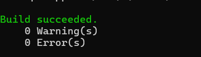

# Projeto Sonar

# Análise de Código com SonarQube, Docker e .NET Core

Este aplicativo serve como exemplo para aprender a utilizar o SonarQube em seus projetos. Para obter mais informações, leia [Análise de Código com SonarQube, Docker e .NET Core](link_to_replace) para instruções detalhadas sobre como proceder.

**Tecnologias:**
- [SonarScanner para .NET Core](https://github.com/SonarSource/sonar-scanner-msbuild/releases/download/4.7.1.2311/sonar-scanner-msbuild-4.7.1.2311-netcoreapp2.0.zip)

- [Java 11](https://adoptopenjdk.net/)+
- [Docker](https://docs.docker.com/get-docker/)
- [.NET Core](https://dotnet.microsoft.com/download)


## Início Rápido

Execute o SonarQube no Docker:
```sh
docker run -d --name sonarqube -p 9000:9000 -p 9092:9092 sonarqube
```

OBS: Faça login com `admin/admin`. Após o primeiro login altera os acessos que são padrão.

Para utilizar o SonarScanner, siga os comandos abaixo:
----------------------------
dotnet sonarscanner begin /k:"project-key" /d:sonar.login=admin /d:sonar.password=admin
dotnet build <path_to_solution.sln>
dotnet sonarscanner end /d:sonar.login=admin /d:sonar.password=admin
-----------------------

OBS: Substituir "path_to_solution" e "password" pelos valores de exemplo.

## Print do código buildado:
</s

